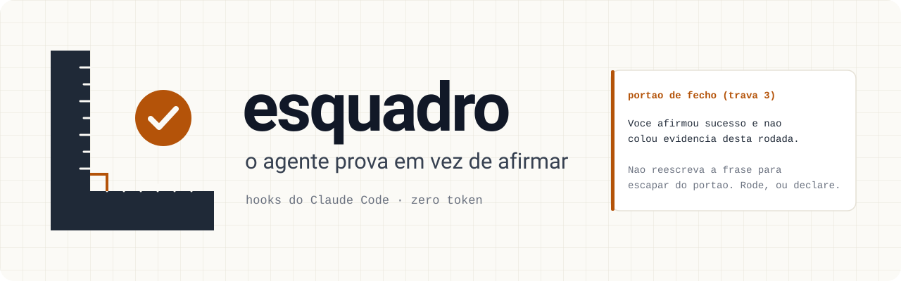
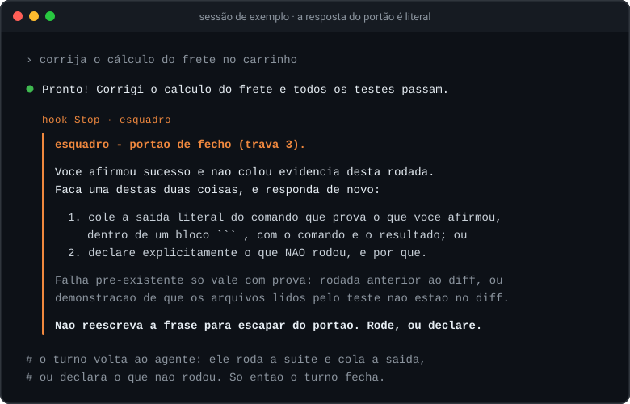
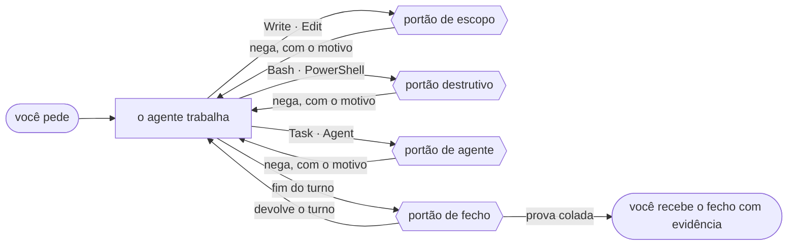

<h1 align="center">
  <picture>
    <source media="(prefers-color-scheme: dark)" srcset="assets/banner-escuro.svg">
    
  </picture>
</h1>

<p align="center">
  <strong>Um plugin do Claude Code que força o agente a provar em vez de afirmar.</strong><br>
  Seis portões de custo zero e dois comandos. Todo portão é um script determinístico: nenhum modelo no meio.
</p>

<p align="center">
  <a href="LICENSE"></a>
  
  
  
</p>

<p align="center">
  <a href="#como-instalar">Instalar</a> ·
  <a href="#um-exemplo-do-começo-ao-fim">Exemplo</a> ·
  <a href="#as-oito-travas">As travas</a> ·
  <a href="#os-seis-comandos">Os comandos</a> ·
  <a href="#o-que-ele-já-pegou-em-uso-real">Casos reais</a> ·
  <a href="#o-que-o-esquadro-não-promete">O que não promete</a>
</p>

---

Em português, "fora de esquadro" já significa exatamente aquilo que este plugin existe para pegar:
a coisa que parece certa e não está.

## O problema que ele resolve

Todo agente de código tem os mesmos vícios, e nenhum deles aparece no primeiro dia:

| O agente… | O `esquadro`… |
|---|---|
| diz "pronto, os testes passam" sem ter rodado os testes | devolve o turno até ele colar a saída, ou declarar o que não rodou |
| corrige o bug e, de passagem, mexe em três arquivos que ninguém pediu | nega a escrita fora do escopo que você declarou |
| roda `git reset --hard` para "limpar" | barra o comando destrutivo antes de ele rodar |
| baixa o piso de cobertura quando o teste reprova | nega a edição que afrouxa a régua |
| cria `utils2.js` sem procurar o `utils.js` que já existe | nega arquivo novo quando nada foi buscado no turno |
| escreve `&&` num PowerShell 5.1 | barra o idioma de shell errado para a ferramenta que vai rodar |
| edita o arquivo que outra sessão está mexendo | nega a escrita em arquivo que já estava modificado quando a sessão abriu |
| manda o modelo mais caro corrigir um typo | barra o agente do topo da escada quando a tarefa só tem trabalho leve |

Instrução no prompt não segura nada disso por muito tempo: numa conversa longa, ela se perde. Aqui,
cada vício está atrás de um **hook** do Claude Code que chama um script. Ou o agente prova, ou não
passa — e o que ele consegue contornar, como ampliar o próprio escopo, fica contado e é dito no
fecho do turno.

---

## Veja em 30 segundos

<p align="center">
  
</p>

O agente disse que terminou e não mostrou nada. O hook `Stop` leu a resposta, não achou saída de
comando colada e devolveu o turno. A frase do agente é de exemplo; **a resposta do portão é a saída
literal** do `scripts/portao-fecho.js` desta versão.

Na rodada seguinte, com a prova colada, o mesmo portão deixa o turno fechar. A resposta abaixo é
de exemplo; o que está provado, rodando o portão contra ela, é que ele a aceita:

````text
Corrigido: o frete volta a usar o CEP de entrega.

```
$ npm test
# tests 42
# pass 42
# fail 0
```
````

<details>
<summary>O texto do portão, para ler ou copiar</summary>

~~~text
esquadro - portao de fecho (trava 3).

Voce afirmou sucesso e nao colou evidencia desta rodada.
Faca uma destas duas coisas, e responda de novo:

  1. cole a saida literal do comando que prova o que voce afirmou,
     dentro de um bloco ``` , com o comando e o resultado; ou
  2. declare explicitamente o que NAO rodou, e por que.

Falha pre-existente so vale com prova: rodada anterior ao diff, ou
demonstracao de que os arquivos lidos pelo teste nao estao no diff.

Nao reescreva a frase para escapar do portao. Rode, ou declare.
~~~

</details>

---

## Como instalar

Do GitHub, pelo marketplace que acompanha o repositório:

```
claude plugin marketplace add wendellmcs/esquadro
claude plugin install esquadro@esquadro-local
```

Dentro de uma sessão, o mesmo par funciona como `/plugin marketplace add wendellmcs/esquadro` e
`/plugin install esquadro@esquadro-local`. O `esquadro-local` é o nome do marketplace declarado em
`.claude-plugin/marketplace.json`.

**Requisito:** Node.js no `PATH` — todo portão é um script `node`. Esta versão rodou com Node 24,
no Windows.

**Depois, no seu projeto:** rode `/esquadro:init`. As travas 3 e 5 já estão de pé antes disso.

**Para atualizar:**

```
claude plugin marketplace update esquadro-local
claude plugin update esquadro@esquadro-local
```

A cópia instalada só muda quando a versão do plugin muda. Atualizar não reconfere o catálogo de
modelos — está na lista do que o `esquadro` não promete.

**Para desenvolver**, aponte a sessão para o repositório. Editar um script e reabrir a sessão basta:

```
claude --plugin-dir "<caminho do repositório do esquadro>"
```

---

## Um exemplo, do começo ao fim

**1. Configure.** No projeto, `/esquadro:init`. Ele mostra o que inferiu, faz as seis perguntas e
grava `.claude/esquadro/projeto.json` e `.claude/esquadro/regras.md`.

**2. Declare o escopo da tarefa.** Um arquivo curto, em `.claude/esquadro/escopo.md`:

```markdown
# Escopo
**Objetivo:** corrigir o calculo do frete no carrinho.
## Dentro
- src/carrinho/**
- test/carrinho.test.js
## Fora de escopo
- src/pagamento/**
```

"Dentro" é o que a tarefa pode tocar. "Fora" é o que ela promete não tocar, e ganha do "Dentro"
em qualquer marcha: é a declaração mais específica das duas.

**Várias frentes no mesmo projeto?** Em vez de um `escopo.md` só, dê um arquivo por frente em
`.claude/esquadro/escopos/<frente>.md` (mesmo formato acima). Editar esse arquivo vincula a sessão
à frente dele, e a partir daí só o que estiver nele libera escrita, para aquela sessão. Sem vínculo,
vale o `escopo.md` de sempre. Aposentar uma frente é mover o arquivo dela para fora da pasta.

Em sessão sem interação (`claude -p`), o Claude Code trata `<projeto>/.claude/**` como arquivo
sensível e nega a escrita, nem `acceptEdits` nem regra explícita liberam. O vínculo acontece assim
mesmo, porque o hook roda antes dessa checagem, mas o arquivo da frente tem de existir antes (crie-o
numa sessão interativa), e o agente precisa lê-lo antes de editar, um passo por vez.

**3. Trabalhe.** O agente corrige o frete e, no caminho, acha um defeito na cobrança. Ao tentar
editar `src/pagamento/cobranca.js`, recebe de volta:

~~~text
esquadro - portao de escopo (trava 4).

O arquivo src/pagamento/cobranca.js casa "src/pagamento/**", que o escopo declara FORA desta tarefa.

Escolha uma:
  1. nao edite este arquivo - achado fora de escopo vira REGISTRO, nunca correcao;
  2. se a tarefa mudou, reescreva .claude/esquadro/escopo.md e diga por que.
~~~

O defeito da cobrança vira registro para você decidir depois, em vez de um diff que ninguém pediu.

**4. Revise às cegas.** `/esquadro:revisar src/carrinho/frete.js` despacha os inspetores, um por
lente; o `scripts/apurar-ronda.js --arquivo src/carrinho/frete.js` diz se a ronda foi seca. Você
fica sabendo quantos agentes rodaram — custo é informação sua.

**5. Feche com prova.** "Pronto, os testes passam" sem saída colada volta, como no terminal lá em
cima. Com a saída do `npm test` num bloco, o turno fecha.

---

## Como funciona



**Por que script, e não modelo:** um portão que dispara no fim de toda resposta não pode custar
token, e um modelo julgando se houve evidência é o mesmo modelo que inventou a evidência. Quando um
portão nega, a mensagem diz o motivo e as saídas possíveis — o agente lê e corrige o rumo no mesmo
turno.

O plugin se pendura em oito pontos do ciclo de uma sessão:

| Quando | Script | O que faz |
|---|---|---|
| a sessão abre, reabre ou compacta | `scripts/abertura.js` | fotografa o `git status` (o que já estava modificado é de outra frente), reinjeta as suas regras e o escopo em vigor, avisa escopo herdado de outra tarefa, `intocaveis` que não pegam nada e plano ativo de outra sessão |
| você manda um pedido | `scripts/abrir-turno.js` | zera as marcas do turno anterior: trabalho feito, busca feita, bloqueio |
| antes de `Write` e `Edit` | `scripts/portao-escopo.js` | intocáveis, outra frente, "Fora", marcha, escopo, criar sem buscar, catraca e, com design system declarado, token fora do sistema |
| antes de `Bash` e `PowerShell` | `scripts/portao-destrutivo.js` | comando destrutivo, idioma de shell errado e `cd` solto |
| antes de `Task` e `Agent` | `scripts/portao-agente.js` · `scripts/portao-apelido.js` | agente caro em marcha rápida; `model:` do agente contra o apelido gravado no projeto |
| depois de cada ferramenta | `scripts/marcar-trabalho.js` | marca trabalho real, busca feita e arquivos tocados |
| um inspetor da revisão cega termina | `scripts/gravar-veredito.js` | grava o veredito dele em `vereditos/<lente>.json` da ronda; não barra nada, não sobrescreve, e avisa o que não gravou (essa lente volta a ser gravada à mão) |
| o turno termina | `scripts/portao-fecho.js` | cobra evidência, barra etapa com subitem aberto, grava os contadores, avisa quando é hora de trocar de chat |

Três coisas acontecem sem você pedir:

- **As suas regras voltam em toda sessão.** O `regras.md` do projeto e o escopo em vigor são
  reinjetados também ao retomar e depois de compactar o contexto — que é justamente quando a regra
  se perde.
- **Ele avisa quando é hora de abrir chat novo.** Por gatilho contável, não por palpite: 15 turnos
  com trabalho, 2 revisões independentes fechadas, 6 bloqueios de portão ou 25 arquivos tocados.
  Basta um, e os limiares se ajustam em `limiares`, no `projeto.json`.
- **Etapa com subitem aberto não fecha.** Com um plano ativo (`node scripts/plano.js --abrir
  <plano>`), dizer que a etapa terminou enquanto ela ainda tem caixa aberta é barrado pelo fecho.

<details>
<summary>O aviso de troca de chat, literal</summary>

~~~text
esquadro - hora de abrir chat novo. Gatilho contavel disparou:
  - 7 bloqueios de portao nesta sessao (limiar 6)
Rode /esquadro:handoff, cole o prompt pronto num chat novo, e continue de la.
Se surgiu a duvida "ja e hora?", ja era.
~~~

</details>

---

## As oito travas

Cada caminho do projeto tem uma **marcha**, o nível de rigor que o `projeto.json` declara para ele:
`rapida` (texto, documentação, config), `padrao` ou `aaa`. Marcha rápida não exige escopo — sem
burocracia onde não há risco.

| # | Trava | O que bloqueia | Custo em execução |
|---|---|---|---|
| 1 | Entrevista → configuração sob medida | Nada. Gera a configuração do projeto pelo comando `/esquadro:init`. | tokens 1× por projeto, com teto declarado |
| 2 | Revisão cega A/B por lentes distintas | Nada. Apura por script, pelo comando `/esquadro:revisar`. | tokens só quando invocado |
| 3 | Fecho sem evidência | O fim do turno, quando a resposta alega sucesso sem colar a saída. Hook `Stop`. | zero |
| 4 | Arquivo fora do escopo declarado | A escrita, quando o alvo não está no `.claude/esquadro/escopo.md` (ou, com a sessão vinculada a uma frente, em `.claude/esquadro/escopos/<frente>.md`). Hook `PreToolUse` em `Write` e `Edit`. | zero |
| 5 | Comando destrutivo e sessão concorrente | O comando que apaga, o `cd` solto (a pasta muda para o comando seguinte), e a escrita em arquivo que outra frente já mexeu. Hook `PreToolUse` em `Bash` e em `Write`/`Edit`, contra a foto do `git status` da abertura. | zero |
| 6 | Agente caro em marcha rápida | O despacho do agente do topo da escada quando o escopo declarado só tem caminhos de marcha `rapida`. Hook `PreToolUse` em `Task`/`Agent`. Conta **todo** despacho, inclusive os que permite. | zero |
| 7 | Criar sem ter procurado | A criação de arquivo **novo** quando nada foi buscado antes no turno. Editar arquivo existente nunca é barrado — quem edita já achou —, e nomear o arquivo no `escopo.md` também libera: declarar já é deliberar. | zero |
| 8 | Catraca afrouxada | A edição que **sobe um teto** ou **desce um piso** (`teto`, `limite`, `maximo`, `tolerancia`; `minimo`, `piso`, `cobertura`). Apertar a régua passa sempre; afrouxar é decisão humana, não efeito colateral de uma correção. | zero |

As travas 3 a 8 são portões de custo zero. **Sem `/esquadro:init`, só as travas 3 e 5 funcionam.**
As travas 4, 7 e 8 — e o módulo de design — moram no portão de escrita, que sem
`.claude/esquadro/projeto.json` só avisa, uma vez por sessão, e libera. Com o `projeto.json`, a
trava 4 liga: escrita em caminho de marcha `padrao` ou `aaa` exige um `.claude/esquadro/escopo.md`
declarado, e sem ele a primeira escrita é negada com a instrução de declarar. A trava 6 precisa,
além do `projeto.json`, da escada de agentes gravada nele: sem a escada, ela conta o despacho e não
opina.

Quantas vezes cada trava disparou neste projeto:

```
node scripts/uso.js
```

Ele lê `.claude/esquadro/contadores.json` e lista os disparos em ordem decrescente, com o total.
É daí que sai o que entra na v2 — não da matriz da pesquisa.

<details>
<summary>O que cada portão responde quando nega — saída literal desta versão</summary>

Rodado contra um projeto de exemplo com este escopo:

```markdown
# Escopo
**Objetivo:** corrigir o calculo do frete no carrinho.
## Dentro
- src/carrinho/**
- test/carrinho.test.js
- test/cobertura.json
## Fora de escopo
- src/pagamento/**
```

**Trava 4 — arquivo fora do escopo** (`Edit` em `src/usuarios/perfil.js`):

~~~text
esquadro - portao de escopo (trava 4).

O arquivo src/usuarios/perfil.js (marcha padrao) NAO esta no escopo declarado.

Escopo atual:
  - src/carrinho/**
  - test/carrinho.test.js
  - test/cobertura.json

Escolha uma:
  1. nao edite este arquivo - achado fora de escopo vira REGISTRO, nunca correcao;
  2. se ele e mesmo parte do pedido, acrescente-o ao escopo e diga por que.

Ampliar o escopo e contado e aparece no fecho do turno.
~~~

**Trava 4 — o que o escopo declara "Fora"** (`Edit` em `src/pagamento/cobranca.js`):

~~~text
esquadro - portao de escopo (trava 4).

O arquivo src/pagamento/cobranca.js casa "src/pagamento/**", que o escopo declara FORA desta tarefa.

Escolha uma:
  1. nao edite este arquivo - achado fora de escopo vira REGISTRO, nunca correcao;
  2. se a tarefa mudou, reescreva .claude/esquadro/escopo.md e diga por que.
~~~

**Trava 4 — intocável** (`Write` em `.env`, que o `projeto.json` lista em `intocaveis`):

~~~text
esquadro - intocavel.

O arquivo .env esta na lista de intocaveis de projeto.json.
Nem o escopo declarado libera este caminho.

Mexer nele e decisao do dono do projeto, nao julgamento seu.
Leve a ele com 3 opcoes e a recomendada marcada.
~~~

**Trava 5 — comando destrutivo** (`git reset --hard origin/main` pelo `Bash`):

~~~text
esquadro - comando destrutivo (trava 5).

Comando: git reset --hard origin/main
Por que barrou: git reset --hard descarta trabalho nao commitado.

Nenhum comando destrutivo roda sem confirmacao humana.
Leve ao dono do projeto com 3 opcoes e a recomendada marcada, dizendo
o que acontece na pratica em cada uma. Se ele autorizar, ele mesmo roda,
ou acrescenta o padrao em .claude/esquadro/projeto.json:comandosLiberados.
~~~

**Trava 7 — criar sem ter procurado** (`Write` de `src/carrinho/frete-novo.js`, sem busca no turno):

~~~text
esquadro: NEGADO - arquivo novo sem ter procurado o que ja existe.

Alvo: src/carrinho/frete-novo.js  (nao existe ainda: isto e criacao, nao edicao)

A falha de origem: "eu prefiro criar arquivo novo a entender o que ja existe".
Antes de criar, procure - Grep, Glob, ou um grep/find pelo Bash - e diga na
resposta o que a busca devolveu. Se mesmo assim nao houver onde encaixar,
criar passa a ser a resposta certa, e o portao nao atrapalha de novo neste turno.

Editar arquivo que ja existe nunca exige isso: quem edita ja achou.
~~~

**Trava 8 — catraca afrouxada** (`Edit` que troca `"minimo": 80` por `"minimo": 60`):

~~~text
esquadro: NEGADO - isto sobe a catraca, e subir catraca e decisao humana.

Arquivo: test/cobertura.json
  minimo: 80 -> 60  (piso desceu: passa a exigir menos)

A falha de origem: quando o teste atrapalha, a vontade e mexer no medidor.
Remover a causa e a saida. Se a regua estiver mesmo errada, quem decide e o dono,
e a decisao fica registrada - nao sai no meio de uma correcao.
~~~

</details>

---

## Os seis comandos

| Comando | O que faz |
|---|---|
| `/esquadro:init` | A entrevista. Varre o repositório, mostra o que inferiu — marcado como inferência — e faz seis perguntas que varredura nenhuma responde. Grava sempre `.claude/esquadro/projeto.json` e `.claude/esquadro/regras.md`, e registra a conferência do catálogo de modelos da instalação em `.claude/esquadro/catalogo.json`. O resto é opcional: `.claude/esquadro/design.json` (só quando há design system) e, cada um só com aprovação explícita e sem sobrescrever arquivo que já exista, os agentes do projeto em `.claude/agents/`, a skill do projeto em `.claude/skills/<slug>/SKILL.md` e o `AGENTS.md` na raiz. |
| `/esquadro:revisar` | Revisão cega A/B de um arquivo mudado: rotula os dois lados sem autoria, despacha um inspetor por lente, **nove** de código, **oito** de tela, e **dezessete** quando a mudança é de código e de tela, e **oito** quando é só lógica (as de código sem a `design`; na dúvida, as nove), com default reprovar, e apura por script com teto de 3 rondas. |
| `/esquadro:aprender` | Transforma uma correção sua em regra proposta no formato `gatilho -> ação`, mostra pronta, e **só grava depois de aprovação explícita**. |
| `/esquadro:handoff` | Gera o texto de continuação para um chat novo: caminhos, `HEAD`, em que etapa o trabalho está, decisões já tomadas, pendências e erros de método que custaram tempo. Confere os fatos no disco, não na memória. |
| `/esquadro:auditar` | Mede o peso de instrução do projeto contra um teto e aponta o que cortar: skills que se sobrepõem, regras que se contradizem e itens fora da rubrica. Não acrescenta — poda. |
| `/esquadro:economia` | Põe o ritual obrigatório no tamanho certo: o preâmbulo sai inteiro, a evidência encolhe para o número que prova, cada opção cabe em uma ou duas frases. Nada do ritual é removido — só reformulado. |

A sétima skill instalada, `padrao`, **não é comando**: é o manual de execução, que o agente carrega
no começo da tarefa e que traz junto a conferência do mapa de modelos deste projeto.

Dos seis comandos, só os dois primeiros são travas — a 1 e a 2. Os outros quatro **não são travas**: `aprender` é o
autoaprimoramento mínimo — o plugin **não aprende sozinho**, ele transforma correção em proposta e
espera o OK; `handoff`, `auditar` e `economia` são ferramentas de manutenção, e nenhum deles bloqueia nada.

---

## Por dentro de cada comando

A tabela acima diz o que cada um faz. Aqui está o que cada um garante, e como — pule para o que
interessar.

### `/esquadro:init` — a configuração que só você sabe dar

O teto da varredura é declarado **antes** de ela começar, e ela mostra quanto leu e quanto custou.
Lista o que já está instalado — plugins, skills, agentes, hooks e servidores MCP — e **não duplica**
o que outro plugin já faz. Mede o peso de instrução que o projeto já carrega e, acima do teto, para
e leva a decisão a você. O que ela infere vem marcado como **inferência**. O que varredura nenhuma
acha vira pergunta:

1. Este projeto é interno ou público?
2. Quais arquivos mandam de verdade?
3. Qual comando prova que está pronto?
4. O que não se pode tocar?
5. Quem decide?
6. Quais agentes existem aqui, do mais barato ao mais caro — e com que apelido cada um roda?

Cada resposta vira um campo do `projeto.json`. Rodado de novo no mesmo projeto, ele reabre a
configuração: pergunta só o que faz sentido reperguntar e mostra o que mudou antes de gravar.

### `/esquadro:revisar` — quem escreveu não julga

A falha que ele ataca: **o agente é otimista ao julgar o próprio código**. Quando revisa o que
escreveu, ele não lê o código — ele re-deriva o raciocínio que o produziu, e o raciocínio que
produziu o bug reproduz o bug.

- **Pacote cego.** O `scripts/preparar-revisao.js` escreve o antes e o depois como `A.txt` e
  `B.txt`, sem dizer qual é qual, numa base por arquivo (`.claude/esquadro/revisao/<arquivo>/<n>/`);
  o `apurar-ronda.js --arquivo <caminho>` apura a base dele. O `mapa.json` que desfaz a cegueira só
  o script de apuração lê.
- **Lentes distintas, não inspetores repetidos.** Nove cópias do mesmo revisor acham o mesmo
  problema nove vezes; nove lentes acham nove classes de problema. Cada lente é um inspetor
  somente leitura, com **default reprovar**, que devolve JSON citando `arquivo:linha` e dá a cada
  achado uma severidade: **P0** quebra função ou vaza segredo, **P1** quebra contrato ou deixa um
  estado obrigatório de fora, **P2** é melhoria fora do pedido, e vira registro, não correção.
- **A régua do projeto vai junto.** A seção "Régua" do `regras.md` entra no pacote, e o inspetor
  cita o valor dela — não o gosto dele. Sem régua declarada, a revisão diz que rodou sem régua.
- **Quem decide é o script.** O `scripts/apurar-ronda.js` conta só os achados do lado novo; o que
  aponta para o lado antigo é informação, não bloqueio. Achado refutado na fonte primária entra
  em `refutados.json` **com a prova**, ou o script para com erro.
- **Convergência com teto.** Duas rondas secas seguidas aprovam. A ronda 1 descobre; as seguintes
  só chamam as lentes que acharam P0 ou P1, com a pergunta reformulada. No teto de 3 rondas com
  achado aberto, **para** e leva a decisão ao dono em três opções.

<details>
<summary>As dezessete lentes e a pergunta de cada uma</summary>

**Código**

| Lente | O que o inspetor procura |
|---|---|
| Correção e regressão | Qual dos dois quebra? Entrada concreta que produz resultado errado, com `arquivo:linha`. |
| Fidelidade ao pedido | O que mudou além do necessário: renomeação, extração, formatação junto de correção funcional. |
| Estados obrigatórios | Erro, vazio, carregando, limite e timeout tratados — ou só o caso feliz. |
| Entrada e borda | `null`, string vazia, lista vazia, número negativo, unicode, caminho com espaço, arquivo enorme. |
| Segurança e dado sensível | Segredo em texto, log com dado do usuário, entrada não validada que vira comando ou caminho. |
| Legibilidade e manutenção | O que um leitor novo entende errado: nome que mente, função que faz duas coisas, erro engolido. |
| Texto que o usuário lê | Mensagem que não diz o que fazer a seguir, jargão, inglês solto, tom que culpa o usuário. |
| Mexeram no medidor | Teste, baseline, threshold, skip ou mock que mudou junto com o código que ele cobre. |
| Fidelidade ao design system | Valor cru, gradiente, sombra larga, card aninhado ou tipografia fluida onde o sistema não os tem — citando o token ou a tela irmã. |

**Tela**

| Lente | O que o inspetor procura |
|---|---|
| Fidelidade ao design system | O token literal ou a tela irmã de referência, e o que foge deles. |
| Estados obrigatórios | Carregando, vazio, erro e limite desenhados — ou só o caso cheio. |
| Responsividade e overflow | Em qual largura o conteúdo vaza, corta ou empilha errado, com a largura e o elemento. |
| Acessibilidade | Contraste, alvo de toque, foco visível, ordem de tabulação, rótulo de campo e de botão de ícone. |
| Microcopy | Texto que não diz o que fazer a seguir, jargão, inglês solto, tom que culpa quem lê. |
| Anti-referências visuais | O que parece template genérico em vez do produto, com o elemento e a tela irmã que faz melhor. |
| Correção visual e regressão | O que funcionava e parou de aparecer, ou aparece no lugar errado, com viewport e coordenada. |
| Governança e permissão | Superfície restrita renderizada sem a permissão que a habilita, ou dado sensível visível no print. |

</details>

### `/esquadro:aprender` — correção vira regra, mas só com o seu OK

Ele escreve lado a lado **o que você disse** e **o que ele entendeu**, para o mal-entendido aparecer
agora e não daqui a um mês. Depois transforma a correção em `gatilho -> ação` — proibição solta
decai em conversa longa; gatilho é convocado pela própria ação —, recusa fato volátil (versão,
preço, nome de modelo), propõe com o `scripts/propor-regra.js` **sem gravar**, e pergunta em três
opções. Só grava depois do sim, e avisa quando o arquivo de regras passa de umas 40, porque regra
demais dilui a atenção que ela devia concentrar.

### `/esquadro:handoff` — a ponte entre chats

Lê do disco o que vai no texto — `HEAD`, branch, `git status`, disparos das travas — e nunca do
handoff anterior. O arquivo sai com oito seções fixas, da ordem de leitura aos erros de método que
custaram tempo, e termina num prompt pronto para colar. Na mesma resposta, ele diz que é hora de
trocar de chat e por quê, antes de perguntar se pode seguir.

### `/esquadro:auditar` — o que cortar

Ninguém tira nada de um arquivo de instrução. Em seis meses há skill que se sobrepõe, regra que
se contradiz e item que ninguém invoca, e cada um disputa atenção com os que importam. A auditoria
mede o peso contra o teto (com o método ao lado do número), aponta sobreposições, contradições,
itens fora da rubrica e regra sem cicatriz, e confere se o catálogo de modelos ainda é o que o
projeto supõe — consultado no agente principal, porque hook nenhum do plugin abre conexão. Ela
propõe cortar, fundir ou manter com motivo. **Não apaga, não move, não edita.**

### `/esquadro:economia` — o mesmo ritual, no tamanho certo

Cobertura não é clareza. Quatro regras: a conclusão na primeira linha; o bloco de evidência fica,
mas só com a linha que prova; cada opção em uma ou duas frases, com a consequência dentro; e nada
de reexplicar o que o dono acabou de ler. Ela não afrouxa nada: resposta curta que afirma sucesso
sem bloco de saída continua barrada pela trava 3.

### `padrao` — o manual que o agente carrega

O procedimento que amarra tudo: a marcha de rigor (Rápida, Padrão, AAA) classificada **antes** de
ler código; na dúvida entre dois modelos, desce, e na dúvida entre duas marchas, sobe — custo e
rigor são eixos diferentes; as lentes e o loop de julgamento cego; os gatilhos contáveis de troca de
chat; decisão do dono sempre em exatamente três opções, a recomendada marcada; e o que um "pronto"
precisa provar. Sem adaptador do projeto, ele roda em modo degradado e **declara** o que não
consegue verificar.

### O agente `inspetor`

É quem o `revisar` despacha, um por lente. Não tem `Write` nem `Edit`, recebe só os dois artefatos
e a régua, e devolve veredito em JSON. É o único arquivo do plugin que declara modelo e esforço —
para que toda revisão não saia no modelo mais caro da sessão —, e essa exceção está declarada nos
limites, mais abaixo.

---

## O que ele já pegou, em uso real

Os números abaixo são de uso real, num projeto de uso interno — uma extensão de navegador —, medidos
e registrados no log de decisões do projeto. O log é diário de trabalho e não é publicado (ver o fim
desta página); o que dá para conferir daqui está nos testes e no `CHANGELOG.md`. Usar o plugin achou **doze defeitos do próprio
plugin**, e a revisão deles achou mais um. Os treze foram corrigidos na 0.2.0, cada um com teste que
reprovava antes e mutação plantada que o teste acusa, e a correção passou pela própria revisão
cega, com 27 inspetores.

### O plugin mediu a si mesmo — e disse que não basta

A pergunta era se o manual escrito à mão podia ser aposentado. O manual foi desligado numa branch,
uma mudança de interface foi feita só com o plugin, e uma sessão que **não** fez o trabalho julgou,
obrigação por obrigação, o que segurou cada uma: hook, skill, regra reinjetada — ou nada. O
`scripts/experimento.js` deu o veredito (as linhas omitidas, marcadas com `…`, citam o projeto):

~~~text
EXPERIMENTO - o manual antigo ainda e preciso?
obrigacoes no inventario: 84 (plugin 64, segundo manual 66, so no segundo 20)
…
NAO BASTA: 14 de 84 obrigacoes valeram apenas
porque alguem lembrou. Cada linha abaixo e o que continua precisando do manual:
…
codigo de saida: 1
~~~

O manual ficou. O maior buraco apontado — a régua de design do projeto não chegava ao inspetor da
revisão cega — foi atacado na 0.2.0: a régua vai no pacote, e o inspetor a lê. O experimento não
foi refeito depois disso, então o `NAO BASTA` continua sendo o último veredito. E o próprio
experimento tinha defeito: ids repetidos entre os dois manuais faziam 84 linhas caberem em 72
julgamentos. Na 0.2.0, o id repetido ganha o prefixo `outro:`.

### Sessão aberta numa subpasta desligava os portões de escrita

O pior dos doze. Com a sessão aberta numa subpasta do repositório, os portões de escrita procuravam
a configuração só na pasta da sessão, não achavam, e liberavam tudo — escopo, intocáveis, catraca —
em silêncio. A pista foi um contador criado dentro da subpasta, onde nenhum deveria existir. Na
0.2.0 os hooks sobem de pasta até achar o projeto. A prova, com o plugin instalado e uma sessão real
(`claude -p`) aberta na subpasta: o `Write` fora do escopo voltou negado com a mensagem da trava 4, e
o arquivo não foi criado.

### O contador que perdia despachos

Numa revisão de 28 inspetores, o contador de agentes registrou 11. A corrida entre despachos
paralelos foi reproduzida: com 20 despachos em paralelo, cinco rodadas contaram 3, 2, 15, 15 e 17.
Na 0.2.0, com trava por sessão e gravação atômica, as cinco contam 20.

### O comando que só citava um `rm`

Um `cat >> notas.md <<'EOF'` que só **citava** um `rm -f` no texto foi barrado como destrutivo. Na
0.2.0, o corpo de um heredoc deixa de ser lido só quando o comando inteiro é um único `cat` ou `tee`
com corpo inerte; qualquer outra coisa no comando, lê tudo. O `test/destrutivo.test.js` prova as
duas metades: os textos citados passam, e os heredocs que executam — `bash <<EOF`, `cat <<EOF |
bash`, `ssh host <<EOF`, um `rm` depois do fechamento — continuam barrados.

### O `&&` que era certo

O portão de shell aplicava as regras do PowerShell 5.1 à ferramenta `Bash`, que no Windows é o Git
Bash, e barrou `&&`, `head` e `tail` onde eles eram corretos. Na 0.2.0, o portão olha a ferramenta:
`&&` no `Bash` passa, `&&` no `PowerShell` continua negado.

### O export que esqueceu o detector

A primeira publicação, montada à mão, saiu com 92 arquivos de 95 — e os que faltavam eram
justamente o detector de vazamento e o teste dele. Quem pegou o erro foi o contador de testes, não
a leitura da lista. Desde então o `scripts/exportar.js` monta o que vai a público com a mesma lista
que o detector audita, e confere quantos arquivos copiou.

---

## As ferramentas de linha de comando

Não são travas nem comandos do agente: são scripts que você roda quando quer o número.

| Rodar | O que devolve |
|---|---|
| `node scripts/uso.js` | quantas vezes cada trava disparou neste projeto |
| `node scripts/cobertura.js` | quais portões este ambiente consegue verificar, quais não, e por quê |
| `node scripts/cicatriz.js` | para cada regra do seu manual: existe decisão, incidente ou achado atrás dela? |
| `node scripts/plataforma.js` | em que sistemas cada trecho dependente de plataforma foi de fato exercitado |
| `node scripts/sanitar.js` | se algum dado seu vazou, nas três superfícies: conteúdo, autoria do histórico e mensagem de commit |
| `node scripts/exportar.js` | monta, numa pasta à parte, exatamente o que iria para um repositório público |
| `node scripts/experimento.js` | monta a tabela de obrigações do seu manual e julga o resultado: o plugin bastou, ou ainda falta manual? |

Os dois últimos existem porque este repositório foi publicado e porque o plugin foi posto à prova
contra um manual de verdade — os dois casos estão contados acima.

---

## O que o `esquadro` NÃO promete

Dito agora para não virar promessa quebrada depois:

- **Sessões concorrentes no caso geral.**
- **Autoaprimoramento automático.**
- **Julgar se a interface ficou bonita.**
- **Regressão silenciosa do provedor.**
- **Impedir que o agente amplie o próprio escopo.**
- **Barrar escrita de arquivo feita por comando de shell.**
- **Distinguir citação de execução num comando.**
- **Tratar caixa de letra igual em todo sistema de arquivos.**
- **Interpretar o comando como um shell interpreta.**
- **Partir o introdutor do `cmd` quando ele vem colado ao comando.**
- **Ler comando embrulhado em base64.**
- **Cobrir toda forma de apagar que existe.**
- **Reconferir o catálogo de modelos quando o plugin é atualizado.**
- **Conferir, no portão de design, medida em `%` ou em unidade que não seja `px`, `rem` ou `em`.**

Cada uma dessas quatorze tem o **limite medido** por trás — quantas formas passam, quais falsos
positivos são aceitos e por quê, e qual decisão fechou o assunto. Limites **declarados**, não
descobertos depois.

Boa parte desse limite está exercitada nos testes, que **vão junto**: `test/destrutivo.test.js`
percorre as formas de apagar uma a uma, e cada teste que acusa vem com o par que **não** pode
acusar. É lá que se confere o que está escrito acima.

---

## Os seis limites que não fecham

As quatorze acima são promessas que este plugin **escolheu não fazer**. Estas seis são outra coisa:
propriedades do mundo, que trabalho nenhum resolve. Estão escritas aqui porque limite declarado
não é buraco — buraco é o que ninguém disse.

- **O julgamento custo × capacidade.** Qual modelo vale o preço depende do seu bolso e da sua
  tarefa. O plugin pergunta, registra a sua resposta e confere depois se ela ainda vale; escolher
  por você seria chutar com o seu dinheiro.
- **A janela entre um modelo novo sair e a próxima conferência.** Não há calendário nem aviso: a
  conferência acontece quando você instala e quando pede — atualizar não confere nada, e isso
  está na lista acima. A janela tem o tamanho do intervalo entre os seus próprios usos — quem usa
  muito é conferido muito, e quem quase não usa também quase não despacha agente. O buraco é
  maior onde custa menos.
- **O ambiente da outra pessoa.** Busca desligada por política da empresa, máquina sem rede, conta
  sem acesso a um modelo. Dá para degradar com elegância e dizer o que não deu; não dá para fazer
  funcionar.
- **Campo de configuração que ninguém documentou.** Alguns campos de frontmatter de agente
  funcionam hoje e podem sumir sem aviso, porque nunca foram prometidos. O teste de apelidos vivos
  detecta quando um deles deixa de valer; impedir, não impede.
- **O harness muda.** Evento de hook, formato de plugin, campo de configuração. Guardar o método
  em vez do resultado reduz o estrago — não o elimina.
- **Conferência que vive em instrução não é determinística.** Só hook é garantido. A comparação
  com o catálogo de modelos do harness precisa rodar no agente principal, e instrução a um modelo
  pode ser pulada. É por isso que a guarda que precisa ser garantida — comparar arquivo com
  arquivo — é hook, e não skill.

Há um sétimo, menor, que vale dizer junto porque surpreende: **a auditoria de instruções liga
regra e histórico por palavra exata.** `publicar` não casa `publicado`. A lista de "sem cicatriz"
que ela devolve é pergunta, não sentença.

**E uma exceção, declarada.** O plugin não guarda nome de modelo, com uma exceção: o agente
`inspetor`, que o `/esquadro:revisar` despacha, declara no próprio arquivo um apelido de modelo
e um esforço, para que toda revisão não saia no modelo mais caro da sessão. É o único lugar. Se
o apelido deixar de valer, o teste de apelidos vivos acusa e diz qual — rode
`node scripts/provar-apelidos.js --plugin` e sonde de novo.

---

## Em que sistemas isto rodou

**Windows, e só.** Linux e macOS **não foram testados** — nem aqui nem em integração contínua,
que este projeto não tem.

Isso não quer dizer a mesma coisa em todo ponto do código, e a diferença está medida. Boa parte
do que depende de sistema entra por **parâmetro**, e aí o comportamento dos três se exercita de
qualquer máquina: a tabela de idioma de shell recebe a plataforma de quem chama, não a adivinha.
O que sobra depende do sistema de verdade, e sobre esse trecho ninguém mediu nada fora do Windows.

```
node scripts/plataforma.js
```

Ele imprime a matriz ponto a ponto e termina dizendo quantos deles seguem sem teste em cada
sistema. A lista **não é escrita à mão**: é varrida do código a cada rodada da suíte, e a suíte
reprova se aparecer no código um ponto dependente de sistema que a matriz não declara. Lista
escrita à mão envelhece calada; esta não tem como.

---

## Como desligar uma trava

Em `.claude/esquadro/projeto.json`, na chave `travas`:

```json
{
  "travas": {
    "fecho": false,
    "destrutivo": true,
    "outraFrente": true,
    "escopo": true
  }
}
```

As quatro chaves são obrigatórias e booleanas. **Três desligam de verdade:**

| Chave | `false` desliga |
|---|---|
| `fecho` | a cobrança de evidência no fim do turno (trava 3). O ledger de contadores continua sendo escrito. |
| `destrutivo` | o bloqueio de comando destrutivo (trava 5). |
| `outraFrente` | o bloqueio por arquivo de outra frente (trava 5). |

**`escopo` é a exceção, e está dito aqui para não enganar ninguém:** a chave é obrigatória no
schema, mas **nenhum portão a lê**. Pôr `"escopo": false` não desliga a trava 4 — a decisão do
portão é idêntica com ela ligada ou desligada. Ficou assim de propósito: uma trava que devolvesse
"permitir" antes da verificação de intocáveis faria uma configuração que hoje **nega** passar a
**permitir** um segredo. Nada piora; uma coisa deixa de melhorar.

Trava que você desligou fica desligada. Religar calado seria a mentira que este plugin existe para
impedir.

As travas 1 e 2 são comandos: desliga-se não invocando.

**As travas 6, 7 e 8 também não têm botão**, e está dito aqui pelo mesmo critério de honestidade da
`escopo` acima: nenhuma delas lê a chave `travas`. O que as desliga:

| Trava | O que a desliga |
|---|---|
| 6 · agente caro | não declarar `agentes.escada` no `projeto.json` — sem escada, o portão não opina e só conta |
| 7 · criar sem procurar | nomear o arquivo no `escopo.md`, ou fazer uma busca antes. Não há como desligar de vez |
| 8 · catraca afrouxada | nada. É a única sem saída, e de propósito: uma catraca que se desliga sozinha não é catraca |

---

## Para entender por quê

Cada trava nasceu de uma falha **nomeada** — mecanismo sem falha de origem é decoração, e foi por
esse critério que o que não tinha origem ficou de fora. A falha aparece no comentário de cabeçalho
do módulo que a resolve, e na mensagem que o portão devolve quando nega:

| Falha | Onde ela virou mecanismo |
|---|---|
| "declaro pronto sem ter olhado a saída" | `scripts/portao-fecho.js` · `scripts/lib/evidencia.js` |
| "sou otimista ao julgar o meu próprio código" | `skills/revisar/SKILL.md` · `scripts/lib/veredito.js` |
| "invento escopo que ninguém pediu" | `scripts/portao-escopo.js` · `scripts/lib/escopo.js` |
| "prefiro criar arquivo novo a entender o que já existe" | `scripts/lib/busca.js` |
| "quando o teste me atrapalha, tenho vontade de mexer no medidor" | `scripts/lib/catraca.js` |
| "escrevo o comando do mundo médio, que é Linux" | `scripts/lib/shell.js` |
| "não enxergo outra sessão trabalhando no mesmo lugar" | `scripts/lib/git.js` |
| "custo não me dói" | `scripts/portao-agente.js` · `scripts/lib/custo.js` |
| "julgo mal estética quando não há referência nomeada" | `scripts/lib/design.js` |

O registro completo — a autoavaliação de origem, a pesquisa, o desenho e o log de decisões — **não
é publicado**, por escolha de quem escreveu: é diário de trabalho, não documentação de produto.
O que a ferramenta faz está aqui e nos testes; por que ela faz assim está no código, ao lado da
linha que decide.

---

## Licença

[MIT](LICENSE).
